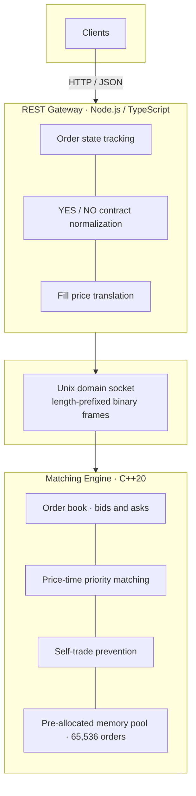

# Binary Matching Engine

A limit-order matching engine for binary prediction markets (YES/NO contracts), exposed over a REST API.

## Benchmarks

| | REST API (autocannon) | Core engine (direct IPC) |
|---|---|---|
| **Latency** | 3 ms | 32 µs |
| **Throughput** | 20k req/s | 95k orders/s |

The REST numbers include gateway and HTTP overhead. Core engine numbers measure matching only, with no REST layer.

## Overview

The system matches buy and sell orders for binary outcome contracts using standard price-time priority: best price first, FIFO within each price level. Fills execute at the resting (maker) price.

Orders are submitted through a TypeScript REST gateway. The gateway tracks client-facing order state, translates YES/NO contract semantics into a single-instrument order book, and communicates with the matching engine over a Unix domain socket using a compact binary protocol.

## Tech Stack

| Layer | Technology |
|---|---|
| Matching engine | C++20, CMake, `-O2` release builds |
| REST gateway | Node.js 20+, TypeScript 5, Express 4 |
| Inter-process communication | Unix domain socket, length-prefixed binary frames |
| Deployment | Docker multi-stage build, Docker Compose |
| Process orchestration | Bash startup script (`scripts/start.sh`) |

## Architecture



**Request flow:** A client sends a JSON order to the gateway. The gateway assigns an order ID, normalizes YES/NO semantics into engine-side bids and asks, and forwards a 24-byte packet over the Unix socket. The engine matches, rests, or rejects the order and returns a batched event frame. The gateway updates local order state and responds to the client in JSON.

Both processes run in a single Docker container. The startup script launches the C++ engine first, waits for the socket, then starts the gateway.

### Matching engine (C++)

The core engine maintains a single-instrument order book with bids and asks only. It does not know about YES/NO contracts.

- **Data structures**: `std::map` for price levels (bids descending, asks ascending), `std::deque` for FIFO queues at each level, `std::unordered_map` for order lookup by ID.
- **Memory**: A fixed-capacity memory pool supports up to 65,536 resting orders without runtime heap allocation for new orders.
- **Matching**: Incoming orders match against the opposite side at the best available price. Partial fills are supported. Unfilled quantity rests on the book.
- **Self-trade prevention**: If an incoming order would match against the same user's resting order, the taker is cancelled and the maker remains. Fills already executed against other users are kept.
- **IPC server**: Listens on a Unix domain socket (default `/tmp/exchange.sock`). Each request is a length-prefixed frame; responses are batched event frames.

### REST gateway (TypeScript)

The gateway sits in front of the engine and handles all client-facing concerns.

- **Contract normalization**: YES orders map directly to engine bids/asks. NO orders are complemented into their YES equivalent before reaching the engine (for example, buy NO at 0.40 becomes sell YES at 0.60). Fill prices are translated back when responding to the client.
- **Order state**: The gateway maintains order status (`open`, `partial`, `filled`, `cancelled`), filled quantity, and average execution price.
- **Resilience**: Reconnects to the engine automatically if the IPC connection drops.

## API Reference

Base URL: `http://localhost:3000`

Prices are in dollars between **0.01** and **0.99** (for example, `0.55` = 55 cents). Quantity is a positive integer.

### `POST /api/order`

Place a new order.

**Request body:**

```json
{
  "userId": "alice",
  "side": "BUY",
  "contract": "YES",
  "price": 0.55,
  "quantity": 10
}
```

| Field | Type | Values |
|---|---|---|
| `userId` | string | Required |
| `side` | string | `BUY` or `SELL` |
| `contract` | string | `YES` or `NO` |
| `price` | number | 0.01 to 0.99 |
| `quantity` | integer | Greater than 0 |

**Response (201):**

```json
{
  "orderId": "1",
  "status": "filled",
  "filledQty": 5,
  "avgExecPrice": 0.55,
  "fills": [
    {
      "makerOrderId": "2",
      "quantity": 5,
      "makerPrice": 0.55,
      "takerPrice": 0.55
    }
  ]
}
```

Returns `422` if the order is rejected or blocked by self-trade prevention. Returns `503` if the engine is unavailable.

### `DELETE /api/order/:orderId`

Cancel an open or partially filled order.

**Parameters:** `userId` (required, via query string or request body)

**Response (200):**

```json
{
  "orderId": "1",
  "status": "cancelled",
  "cancelledQty": 5
}
```

Returns `403` if the order belongs to a different user. Returns `404` if the order is not found or already closed.

### `GET /api/order/:orderId`

Look up the current state of an order.

**Response (200):**

```json
{
  "orderId": "1",
  "userId": "alice",
  "contract": "YES",
  "side": "BUY",
  "price": 0.55,
  "quantity": 10,
  "filledQty": 5,
  "avgExecPrice": 0.55,
  "status": "partial"
}
```

### `GET /api/snapshot`

Return an aggregated order book snapshot.

**Response (200):**

```json
{
  "bids": [{ "price": 0.55, "quantity": 10 }],
  "asks": [{ "price": 0.60, "quantity": 5 }]
}
```

### `GET /health`

Health check. Returns `200` when the gateway is connected to the engine, `503` otherwise.

```json
{
  "status": "ok",
  "engineConnected": true
}
```

## Quick Start

```bash
docker compose up --build
```

Wait until the service is healthy, then open [http://localhost:3000](http://localhost:3000).

### Example session

Place a resting buy order:

```bash
curl -s -X POST http://localhost:3000/api/order \
  -H 'Content-Type: application/json' \
  -d '{"userId":"alice","side":"BUY","contract":"YES","price":0.55,"quantity":10}'
```

Place a sell that crosses and fills against it:

```bash
curl -s -X POST http://localhost:3000/api/order \
  -H 'Content-Type: application/json' \
  -d '{"userId":"bob","side":"SELL","contract":"YES","price":0.55,"quantity":5}'
```

Fetch the order book:

```bash
curl -s http://localhost:3000/api/snapshot
```

Look up an order:

```bash
curl -s http://localhost:3000/api/order/1
```

## Configuration

| Variable | Default | Description |
|---|---|---|
| `HTTP_PORT` | `3000` | Port for the REST gateway |
| `ENGINE_SOCKET` | `/tmp/exchange.sock` | Unix socket path shared by both processes |
| `ENGINE_BIN` | `/app/engine` | Path to the C++ engine binary (container only) |
| `GATEWAY_DIR` | `/app/gateway` | Path to the gateway directory (container only) |

## Project Structure

```
binary-matching-engine/
├── include/
│   ├── Types.h          # IPC packet layouts, enums, constants
│   ├── OrderBook.h      # Order book class definition
│   └── MemoryPool.h     # Fixed-capacity order memory pool
├── src/
│   ├── OrderBook.cpp    # Matching, cancellation, snapshot logic
│   ├── main.cpp         # IPC server and request dispatch
│   └── server.ts        # REST gateway
├── scripts/
│   └── start.sh         # Launches engine then gateway
├── Dockerfile           # Multi-stage build (C++ + TypeScript)
├── docker-compose.yml
├── CMakeLists.txt
└── package.json
```

## Local Development

Build and run without Docker:

```bash
# Build the C++ engine
cmake -B build -DCMAKE_BUILD_TYPE=Release
cmake --build build

# Build and start the gateway
npm install && npm run build

# Start the engine (in one terminal)
./build/engine

# Start the gateway (in another terminal)
node dist/server.js
```

Both processes must share the same `ENGINE_SOCKET` path.

## Improvements

Possible next steps to reduce latency, raise throughput, and extend functionality.

### Lower end-to-end latency

- **Full C++ stack**: Move the REST API into a native C++ web framework alongside the matching engine. This removes the Node.js gateway and IPC hop from the hot path, bringing end-to-end latency down toward the microsecond range the core engine already achieves.
- **Multi-threaded matching engine**: The engine currently runs on a single thread (~95k orders/s). Sharding the book or adding synchronized worker threads (mutex locks or lock-free structures) would increase matching capacity for high-volume markets.

### Higher gateway throughput

- **Node.js clustering**: The engine supports ~100k orders/s over IPC, but the REST gateway tops out around 20k req/s. Running multiple Node.js workers behind a load balancer would better utilize engine headroom and push gateway throughput closer to engine limits.

### Resilience and abuse prevention

- **Rate limiting**: Add IP-based rate limiting on the gateway to protect against spam and denial-of-service traffic.

### Product extensions

- **Multi-outcome markets**: Support linked binary markets under one event (for example, "Who wins?" with separate YES/NO books for candidate A, B, and C), with cross-market matching or coordinated settlement logic.
